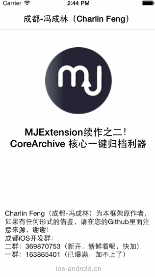

 

    Charlin出框架的目标：简单、易用、实用、高度封装、绝对解耦！
    
    The purpose of Charlin’s frame: simple, ease of use, practical, 
    highly packaged and absolute decoupling.

# CoreArchive
   MJExtension续作之二：存储框架第二季CoreArchive

  

框架截图 CUT
===============
 

版权申明 RIGHTS
===============
Charlin Feng（成都-冯成林）为本框架原作者，如果有任何形式的借鉴，请在您的Github里面注意来源，谢谢！ 

成都iOS开发群： 
二群：369870753（新开，新鲜着呢，快加）  
一群：163865401（已爆满，加不上了）    

框架说明 EXPLAIN
===============
     本框架是隶属说MJExtension续作，我给这个项目取了一个整体上的名字叫做：CoreModel。
     Charlin Feng原创MJExtension续作的目的：一来是向MJExtension致敬，
     二是封装大量ios开发者均迫切需要的功能，就是对数据的本地CURD。基于这个原因，
     所以CoreArchive也成为了CoreModel的成员。当然CoreArchive也因为解耦的原因而独立存在。

  
框架系列申明 SERIES
===============
我是成都开发者，冯成林，开源是一种精神，一种分享，一种态度，或者是一种对传统模式的挑战，
这里没有炫耀，没有装逼，没有金钱，我付出的是一种精神，需要的是您的支持！ 

此系列框架的核心目标是：取代Core Data，实现一键动态缓存！
这是第一个框架，后面还是3个，你要问我为什么写这么散？还有一些朋友批判我，很多项目结构非常“混乱”，
其实，这是因为我有一个宏大的框架在我的所有Frameworks中，最核心的目的是解耦，
因为我个人觉得，如果是功能模块，我会尽量独立出来，站在解耦的核心思想中，我受益太多。希望您能理解。谢谢！
 

此框架是取代Core Data系列框架的第二个框架，是向MJ的MJExtension的续作以及致敬！
主要是完成MJExtension的后续工作：任意模型的一键级联动态缓存。
   

####框架特性： 
>1.更方便快捷的方式保存读取数据。 
>2.静态方式调用。 
>3.基于MJExtension，有非常好用的宏定义，所以你可以一键完成文件的CURD。 

  

框架依赖 DEPENDENCE
===============
.MJExtension
  

使用说明 USAGE
===============

#### 1. 引入头文件 Introduced header
      #import "CoreArchive.h"
 

#### 2. 归档基本数据：int，double，float，bool，string等，这里以double为例：
#### 保存：
        //保存一个Double
        [CoreArchive setDouble:12.7 key:@"level"];
        
#### 保存：
        //从归档中取出Double
        double level = [CoreArchive doubleForKey:@"level"];
        

#### 销毁：
        //销毁本地归档
        [CoreArchive removeDoubleForKey:@"level"];
        

以上均是静态方法调用，请简单吧。
下面来看看自定义对象归档，同样是简单要爆表！
#### 准备工作：
     首先你得自定义一个对象，我这里以用户模型为例，建立一个用户模型
        @interface UserModel : NSObject
    
        @property (nonatomic,copy) NSString *name;
        
        @property (nonatomic,assign) NSUInteger age;

#### 使用框架：
        导入框架头文件
        #import "CoreArchive.h"
        
        然后添加在.h和.m各添加一个宏即可：
        .h头文件添加CoreArchiiver_MODEL_H
        .m头文件添加CoreArchiiver_MODEL_M
        
        一切就搞定了，简单吧，做好之后，应该是如下图所示：

#### 创建一个对象备用：
        //创建一个对象备用
        UserModel *userModel = [[UserModel alloc] init];
        userModel.name = @"张三";
        userModel.age = 27;
        
#### 一键归档自定义对象：
        //一键归档
        BOOL res = [UserModel save:userModel];

#### 一键解档自定义对象：
        //一键解档
        UserModel *userModel =[UserModel read];
        
#### 一键解档自定义对象：
        //删除本地归档
        [UserModel save:nil];
        

好了，简单吧，整体过程你不需要关心key，path这些，框架已经做好了

 

    

致谢 THANKS
===============
#####1.感谢MJ    Thanks MJ!
 
感谢杰哥！致敬MJExtension！希望大家支持杰哥的事业！  

小码哥IT教育：http://www.520it.com

    
#####2.感谢小饭   Thanks XiaoFan!

 
 感谢小饭提供的英文翻译帮助，谢谢！
    

-----
    CoreArchive 核心存储归档工具
-----

  

