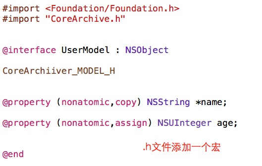
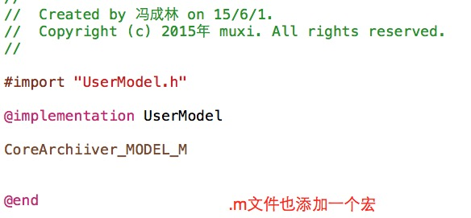

 

####  OC收山之作： CoreModel Series
##CoreArchive
 
.Xcode 5.0, iOS 6.0 
.OC,Swift 
.Under the MIT License 

  

DEPENDENCE
===============
.MJExtension
  

USAGE
===============

#### 1. Introduced header
      #import "CoreArchive.h"
 

#### 2. Basic data archiving：int，double，float，bool，string：
#### Save：
        //Save Double
        [CoreArchive setDouble:12.7 key:@"level"];
        
#### Get：
        //Get Double
        double level = [CoreArchive doubleForKey:@"level"];
        

#### remove：
        //remove
        [CoreArchive removeDoubleForKey:@"level"];
        

Above is a static method call, it's simple.
Let's look at a custom object archiving, the same burst table is so simple!
#### Prepare：
     First you have to customize an object, I am here as a user model as an example, to create a UserModel
     
        @interface UserModel : NSObject
    
        @property (nonatomic,copy) NSString *name;
        
        @property (nonatomic,assign) NSUInteger age;

#### use framework：
        import framework
        #import "CoreArchive.h"
        
        Then add the .h and .m each add a macro:
        .h add CoreArchiver_MODEL_H
        .m add CoreArchiver_MODEL_M
        
 
  
 .h add CoreArchiiver_MODEL_H
  

 .m add CoreArchiiver_MODEL_M
 
 

#### Create a Model：

        UserModel *userModel = [[UserModel alloc] init];
        userModel.name = @"Charlin";
        userModel.age = 27;
        

#### Archive Custom Model: single
#### A key archive custom objects: key: The default pass nil for the framework automatically calculate key, you can also customize key
        //One Key Archive
        BOOL res = [UserModel saveSingleModel:userModel forKey:@"charlin"];

#### One Key UnArchive Custom Model：
        //One Key UnArchive
        UserModel *userModel =[UserModel readSingleModelForKey];
        
#### One Key Remove Custom Model ：
        //Remove
        [UserModel save:nil forKey:@"charlin"];
        
#### Archive Custom Objects: Array. key: The default pass nil for the frame automatically calculate key, you can also customize key
#### A key custom object array Archive：
        //array Archive
        BOOL res = [UserModel saveListModel:@[userModel1,userModel2,...] forKey:nil];

#### A key custom object array UnArchive：
        //UnArchive
        NSArray *listModel = [UserModel readListModelForKey];
        
#### Remove Archive of Array：
        //Remove
        [UserModel saveListModel:nil forKey:nil];
        

  
#### ：
[New] version management

        #import "CoreArchive+Version.h"
    
Use the following three methods, you can easily manage your version number：

        /** Save current version information */
        +(void)saveCurrentVersionInfo;
        
        
        /** Whether the local current version has already been saved */
        +(BOOL)isSavedCurrentVersionInfo;
        
        
        /** The current version number of the program: The system version number, the local version number of non-filing */
        +(NSString *)currentVersion;

  
Well, it is simple, you do not need to be concerned about the overall process key, path these, the framework has already done. 

key: The default pass nil for the frame automatically calculate key, you can also customize key. Of course, you want to be consistent access key.

    

   
Career
===============
#### Charlin's Career

WebSite：http://ios-android.cn  
Sina WeiBo：http://weibo.com/charlin2015/ 
  

#### CoreModel Series

One：CoreFMDB
[https://github.com/nsdictionary/CoreFMDB](https://github.com/nsdictionary/CoreFMDB)

Two：CoreArchive
[https://github.com/nsdictionary/CoreArchive](https://github.com/nsdictionary/CoreArchive)

Three：CoreClass
[https://github.com/nsdictionary/CoreClass](https://github.com/nsdictionary/CoreClass)
  

